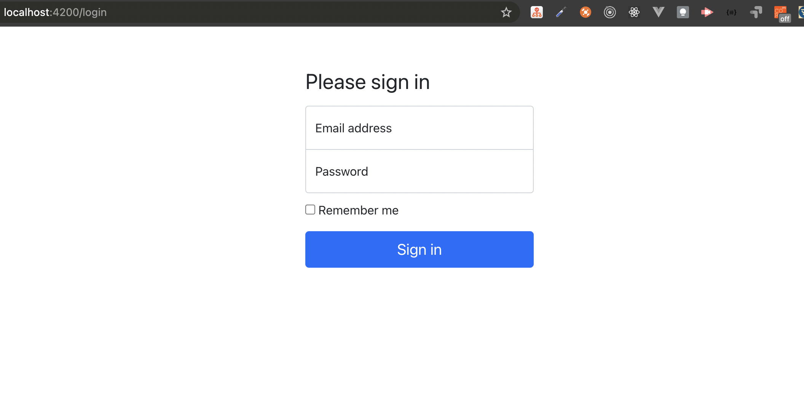

# Exercise 2

In login component let's add markup for login page from bootstrap example: [sign-in](https://getbootstrap.com/docs/5.1/examples/sign-in/) :)

Make sure that login component page styles do not break bookshelf component page

You must create something like this:

