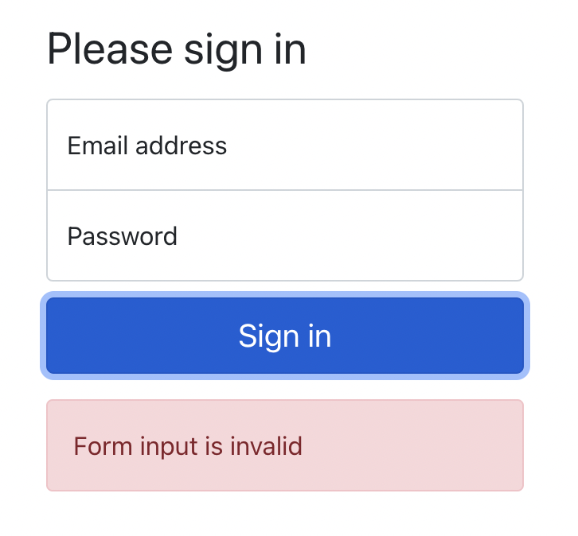
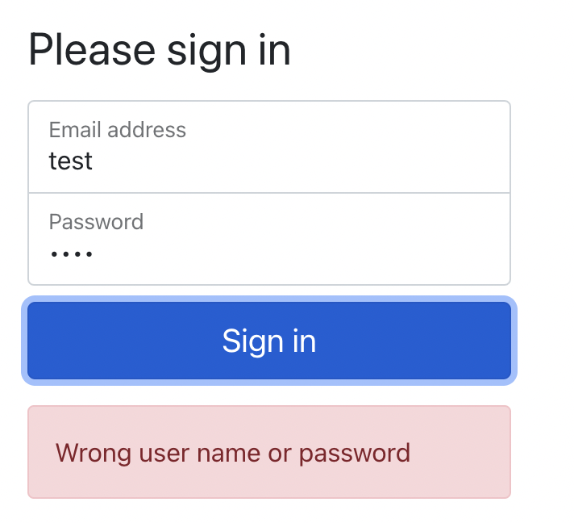
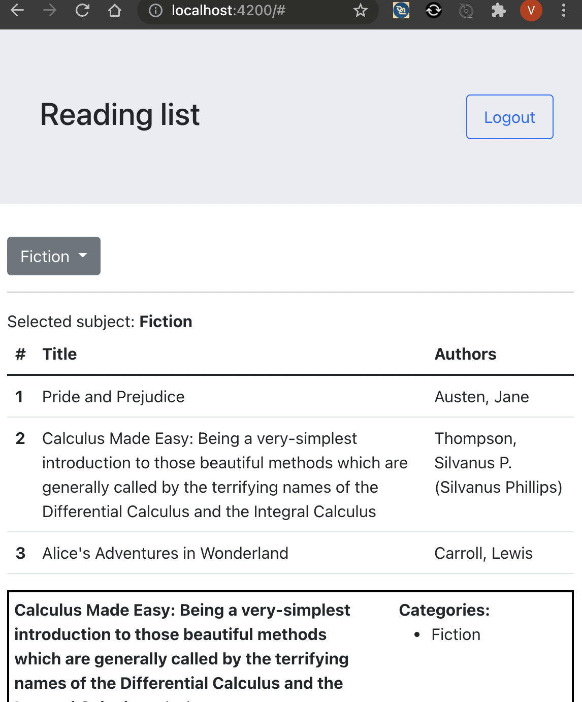

# Exercise 3

* Try to figure out how to add error messages in login component template in form.

---

* Try to implement logout button and logout functionality in main page where we have bookshelf :)

 