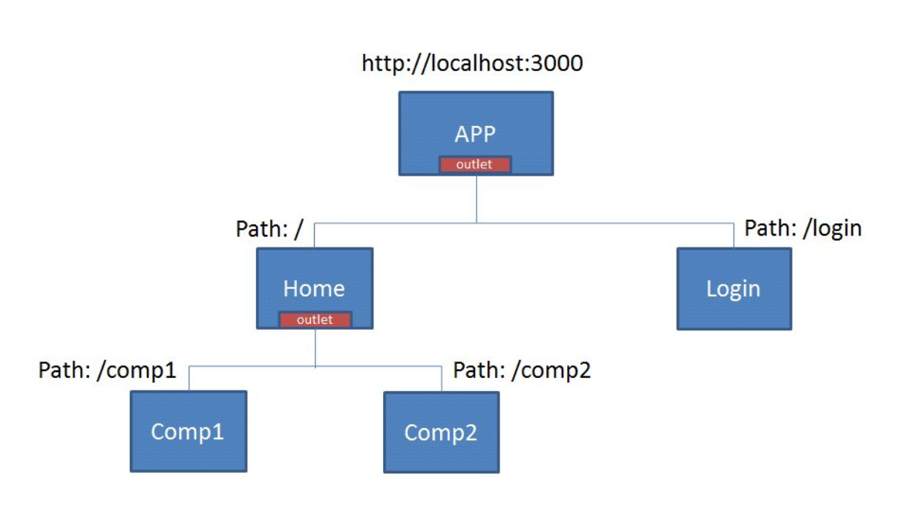

# Routing in Angular

* Components handle routing in Angular.
* When your browser requests a page on your domain, Angular listens to the requests and tries to deliver the required view based on the routes map in the application.

