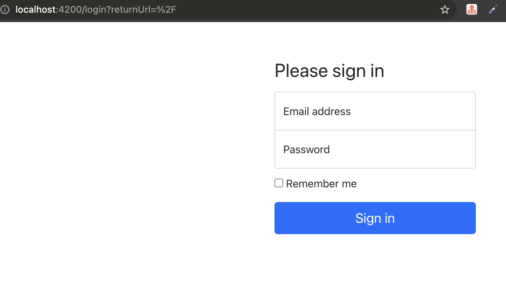

# Let's secure our bookshelf :)

Let's add guard to bookshelf login page:

```ts
const routes: Routes = [
  { path: 'login', component: LoginComponent },
  {
    path: '',
    component: BookshelfComponent,
    canActivate: [AuthenticateGuard],
  }
];
```

No when you will try to access bookshelf you will be redirected to login page :)

